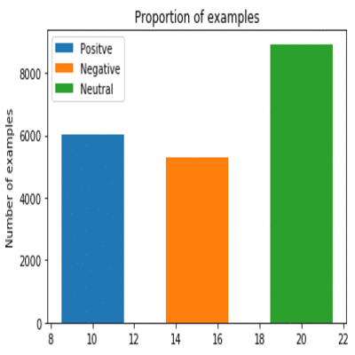
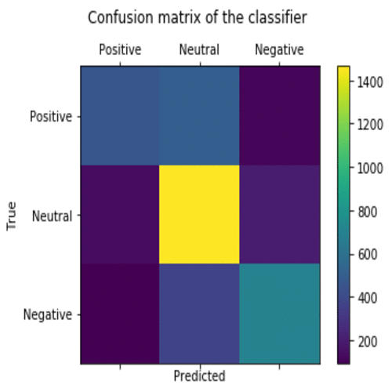

# Sentiment Analysis on Roman Urdu using Python, Sklearn and nltk

### About Dateset

The dataset consist of sentences gathered from reviews of various e-commerce website, comments on public facebook pages, and twitter accounts. Each row would ideally consist of a single sentence and have a corresponding sentiment attach to it, which would be either Negative, Positive or Neutral. There are more than 20,000 sentences and they have been manually tagged.

## Step by Step approach for creating the Model

### Step 1: Importing all necessary modules
Importing the libraries like tinker,numply,sklean,etc. We have to imported everything that we will be using for given task that is sentiment analysis on roman urdu

### Step 2: Import Dataset
Importing dataset taken from UCI https://archive.ics.uci.edu/ml/datasets/Roman+Urdu+Data+Set
This data set contains three columns two are useful one is junk column which will not be used anywhere

### Step 3: Lets have a look at our data set
Looking at the data using functions like head,colunm,row,etc.

### Step 4: We have y in form of categorical data

### Step 5: Cleaning or data Preprocessing

Lets apply some cleaning on text, we have only allowed English character no special characters are allowed and all text are converted to lower case and stopwords of roman urdu are deleted.

### Step 6: Convert feature into vectorize form using TfidfVectorizer

### Step 7: Split data set into training and testing sets
We have used 80% of data for training and 20% for testing

### Step 8: Creating classifier and fitting data in classifier

#### Step 9: Perform Prediction

### Step 10: Create Confusion Matrix
This matrix shows how many correct and wrong prediction were made for each of the category of labels.

### Step 11: Evaluation
Checking the accuracy scorce of the classifiers.

### Step 12: Visualizing confusion matrix
Visualising the  matrix using the matplotlab libaray.

# Our Project Interface
On running the program name “home.py” we will see this interface

User can get the two interfaces. One is to check about the developer and other is to take comment or review as input.
On clicking the button click to know about developer, user landed to the file called “about_us.py”. Interface is 

Then the user click the return to home page button and landed to the previous page.
After that on clicking the button called “Take User Input”, they landed to the file called “PredictUserInput.py”. The user interface is like this

User can type their comment on the box and click the predict sentiment button to see the sentiment.

They can use other buttons according to their requirements.
Then click the EXIT button to exit from the program.
